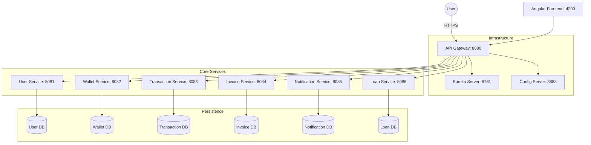

# 💳 Rev-Pay: Next-Gen Financial Microservices Platform


## 🚀 Overview

**Rev-Pay** is an enterprise-grade financial management platform built on a robust **Microservices Architecture**. It enables users and businesses to manage wallets, perform seamless transactions, generate invoices, and apply for loans—all within a unified, high-performance ecosystem.

---

## 🏗️ Why Microservices?

Choosing a microservices architecture for Rev-Pay was a strategic decision to ensure the platform can scale and evolve as a modern fintech solution:

- **Scalability**: Individual services like `transaction-service` can be scaled independently during peak hours without affecting `loan-service`.
- **Fault Isolation**: A failure in the `notification-service` does not bring down the core `wallet-service` or `transaction-service`.
- **Independent Deployment**: Teams can deploy updates to the `frontend` or `user-service` without redeploying the entire system.
- **Technology Flexibility**: Each service can potentially use a different database or tech stack optimized for its specific business logic.

---

## 🗺️ System Architecture

Rev-Pay follows a decoupled microservices pattern, where each service handles a specific business domain.



---

## ✨ Key Features

### 👤 User & Business Ecosystem
- **Omni-Channel Auth**: Secure JWT-based authentication for both individual customers and business accounts.
- **Dynamic Profiles**: Customizable user profiles with role-based dashboard views (Admin vs. Customer vs. Merchant).

### 💰 Digital Wallet & Ledger
- **Instant Settlement**: Real-time balance updates and fund management.
- **Audit Trails**: Complete ledger of every wallet movement for transparency and compliance.

### 💸 High-Performance Transactions
- **P2P & B2B Transfers**: Seamless money transfers between any account type in the ecosystem.
- **Payment Requests**: Built-in flow for requesting funds from other users or clients.

### 📑 Professional Invoicing
- **Automated Billing**: Generate professional PDFs for invoices with auto-calculated taxes and discounts.
- **Client Management**: Track customer payment history and manage debtors efficiently.

### 🏦 Digital Loan Lifecycle
- **End-to-End Application**: Streamlined workflow from loan application to approval and disbursement.
- **Real-time Tracking**: Interactive status updates for active loan requests.

---

## 🛡️ Security Implementation

Security is at the heart of Rev-Pay. We implement a multi-layered security model:

- **JWT Authentication**: Stateless authentication using JSON Web Tokens ensures secure and scalable user sessions.
- **Centralized API Gateway**: Acting as a security barrier, the API Gateway handles authentication checks before requests even reach the microservices.
- **Role-Based Access Control (RBAC)**: Fine-grained permissions ensure users only access the data and actions relevant to their roles (e.g., Customers cannot access Admin panels).
- **Service-to-Service Security**: Internal communication between services is restricted and monitored.

---

## 🏆 Challenges Solved

Building a distributed system comes with unique challenges. Rev-Pay successfully addresses:

- **Service Discovery**: Using **Netflix Eureka**, services find and communicate with each other dynamically without hardcoded URLs.
- **Distributed Configuration**: **Spring Cloud Config** centralizes all environment variables across 10+ services, enabling "change once, apply everywhere."
- **Data Consistency**: Managing distributed transactions across multiple databases while maintaining eventual consistency.
- **Centralized Routing**: The **API Gateway** simplifies frontend complexity by providing a single entry point for all 6+ backend APIs.

---

## 🛠️ Tech Stack

### Backend (Java/Spring)
- **Framework**: Spring Boot 3.x
- **Cloud Native**: Spring Cloud Gateway, Eureka, Config Server.
- **Security**: Spring Security + JWT.
- **Data**: Spring Data JPA / Hibernate / MySQL 8.0.

### Frontend (TypeScript)
- **Framework**: Angular 18+
- **Styling**: CoreUI (Angular), Bootstrap 5, SCSS.
- **Graphics**: Chart.js for real-time financial data visualization.

---

## ⚡ Getting Started

### Prerequisites
- **Docker** & **Docker Compose**
- **Java 17+** & **Node.js 18+**

### Launching the Platform
1. **Start Services**:
   ```bash
   docker-compose up -d --build
   ```
2. **Access Points**:
   - **Frontend**: [http://localhost:4200](http://localhost:4200)
   - **Discovery Port**: [http://localhost:8761](http://localhost:8761)
   - **Central API**: [http://localhost:8080](http://localhost:8080)

---

## 📡 Service Map

| Service | Port | Key Role |
| :--- | :--- | :--- |
| **API Gateway** | 8080 | Security Guard & Request Router |
| **User Service** | 8081 | Identity & Access Management |
| **Wallet Service** | 8082 | Funds & Balance Ledger |
| **Transaction Service** | 8083 | Movement of Money (P2P/Requests) |
| **Invoice Service** | 8084 | Billing & Customer Records |
| **Loan Service** | 8086 | Lending Workflows |
| **Eureka Server** | 8761 | Service Directory |

---

## 🔮 Future Enhancements

- **Real-time Notifications**: Integration with WebSocket/Firebase for push alerts.
- **AI Financial Insights**: Predictive analysis of spending patterns and loan eligibility.
- **Multiple Gateways**: Integration with Stripe and PayPal for external fund transfers.
- **Mobile Companion App**: Cross-platform mobile version using Flutter or Ionic.

---

## 👨‍💻 Author

**Priyanshu Wahane**  
📧 priyanshugwahane@gmail.com  🔗 GitHub: https://github.com/wahanePriyanshu

---


